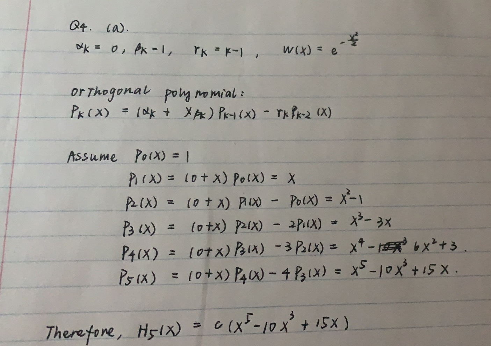
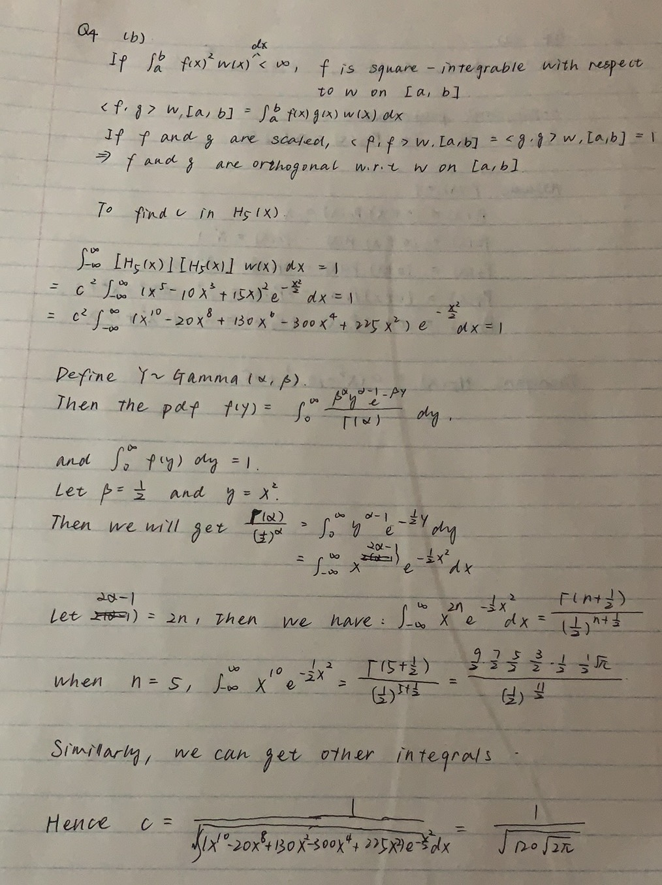
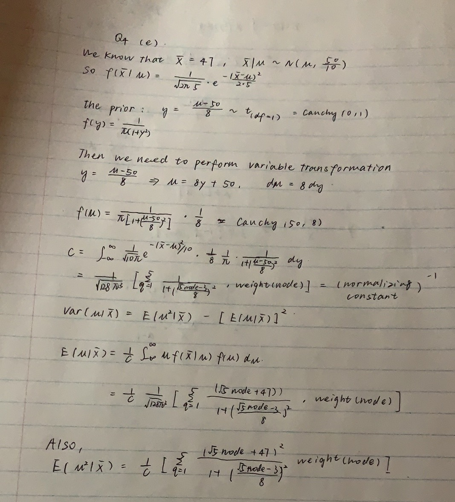

```{r setup, include=FALSE}
knitr::opts_chunk$set(echo = TRUE)
library(tidyverse)
```

## Question 1

#### (a)
The Bayesian model would be $\bar x|\mu \sim N(\mu, \frac{3^2}{7})$ and here our prior is $\mu \sim Cauchy(5,2)$.
```{r q1 p1}
# Import data
x = c(6.52, 8.32, 0.31, 2.82, 9.96, 0.14, 9.64)
xbar = mean(x)

# Construct Bayesian Model
likelihood.function = function(mu) {
  1/sqrt(2*pi*9/7) * exp(-(xbar - mu)^2/(2*9/7))
}

prior.function = function(mu) {
  1/(pi*2*(1 + ((mu - 5)/2)^2))
}
```

Then we need to find the normalizating constant k. Here we need to perform a variable transformation.
Let $\mu=log(\frac{y}{1-y})$, since $-\infty<\mu<\infty$, we will get $0<y<1$.
The Jacobian matrix would be $(1/(y(1-y)))$.
```{r q1 p2}
# define function for y
y.function = function(y) {
  likelihood.function(log(y/(1-y))) * prior.function(log(y/(1-y))) * (1/(y*(1-y)))
}

# Riemann Sum
int_Riemann = function(f, a, b, n = 100000) {
  h = (b-a)/n
  x = seq(a, b, by = h)
  y = f(x)
  result = h*sum(y[1:n])
  return(result)
}

k = round(1/int_Riemann(y.function, 1e-10, 1-1e-10), 5)
k
```

#### (b)
```{r q1 b}
# Define the function for posterior
posterior.function = function(mu) {
  k*likelihood.function(mu)*prior.function(mu)
}

# Riemann Sum
int_Riemann = function(f, a, b, n = 100000) {
  h = (b-a)/n
  x = seq(a, b, by = h)
  y = f(x)
  result = h*sum(y[1:n])
  return(result)
}

# Trapezoidal Rule
int_trapzoidal = function(f, a, b, n = 100000) {
  h = (b - a)/n
  x = seq(a, b, by = h)
  y = f(x)
  result = h * (y[1] + 2*sum(y[2:n]) + y[n+1]) / 2
  return(result) 
}

# Simpson's Rule
int_Simpson = function(f, a, b, n = 100000) { 
  h = (b - a)/n
  x = seq(a, b, by = h)
  y = f(x)
  if (n == 2) {
    result = (h/3) * (y[1] + 4*y[2] + y[3])
  } else {
    result = (h/3) * (y[1] + sum(2*y[seq(2, n, by = 2)]) + sum(4*y[seq(3, n-1, by = 2)]) + y[n+1])
    }
  return(result)
}

# Calculate the posterior probability that 2 <= mu <= 8
data.frame(Method = c("Riemann", "Trapezoidal", "Simpson's"),
           Result = c(int_Riemann(posterior.function, 2, 8),int_trapzoidal(posterior.function, 2, 8), int_Simpson(posterior.function, 2, 8)))
```

All of these three results are close to 0.99605. However, Trapezoidal method has a little bit higher value of integration than the other two methods.

#### (c)
We still need to perform variable transformation before integration.
Let $\mu = log(\frac{u}{1-u})$. Since $3 \le\mu \le \infty$, we have $\frac{e^3}{1+e^3}<\mu<1$. The Jacobian matrix would be $\frac{1}{u(1-u)}$.
```{r q1 c}
# define the posterior function
posterior.function.u = function(u) {
  k*likelihood.function(log(u/(1-u))) * prior.function(log(u/(1-u))) * (1/(u*(1-u)))
}

# Use Riemann sum method
int_Riemann(posterior.function.u, exp(3)/(1+exp(3)), 1-1e-10)
```

#### (d)
Perform variable transformation: $\mu = 1/u$ and then $0<u<1/3$. The Jacobian matrix is $1/u^2$.
```{r q1 d}
# define the posterior function
posterior.function.u = function(u) {
  k*likelihood.function(1/u) * prior.function(1/u) * (1/u^2)
}

int_Riemann(posterior.function.u, 1e-10, 1/3)
```

From (c) and (d), we know that, both results are very close to 0.99086. However, the transformation in (c) is more close.

## Question 2
```{r q2}
# define the function for Romberg's algorithm
int_Romberg = function(f, a, b, m) {
  R = matrix(NA, m, m)
  h = b - a
  R[1,1] = (f(a) + f(b)) * h/2
  for (i in 2:m) { 
    R[i,1] = 1/2 * (R[i-1,1] + h * sum(f(a + (1:2^(i-2) - 0.5) * h)))
    for (j in 2:i) { 
      R[i,j] = R[i,j-1] + (R[i,j-1] - R[i-1,j-1]) / (4^(j-1) - 1)
    } 
    h = h/2
  }
  result = R[m,m]
  
  return(list(R, result))
}

EY = function(a, m) {
  Romberg = int_Romberg(function(x) 1/x, 1, a, m)
  
  # simulated solution (MC integration)
  set.seed(1029)
  x = runif(n=10000, min = 1, max = a)
  y = (a-1)/x
  MC_integration = mean(y)
  
  # theoretical result
  theoretical = log(a)
  
  return(list(Romberg.array = Romberg[[1]],
              Romberg.solution = Romberg[[2]],
              MC.integration = MC_integration,
              theoretical = theoretical))
}

EY(a = exp(1), m = 6)
EY(a = exp(2), m = 6)
EY(a = exp(9), m = 6)
```

From the result, we could see that, when a is a small value, this method works fine. However, when we increase the value of a, the results are much more deviated from the theoretical values.

## Question 3

#### (a)
Plot the weights versus the nodes.
```{r q3 a}
# 10-point Gaussian quadrature rule
nodes = c(-0.148874338981631, 0.148874338981631, -0.433395394129247, 0.433395394129247, 
          -0.679409568299024, 0.679409568299024, -0.865063366688985, 0.865063366688985, 
          -0.973906528517172, 0.973906528517172)
weights = c(0.295524224714753, 0.295524224714753, 0.269266719309996, 0.269266719309996, 
            0.219086362515982, 0.219086362515982, 0.149451394150581, 0.149451394150581, 
            0.066671344308688, 0.066671344308688)

# plot the weights versus nodes
data3 = data.frame(nodes, weights)
data3 %>% 
  ggplot(aes(x = nodes, y = weights)) + geom_point(alpha = 0.4) +
  theme_bw()
```

#### (b)
```{r q3 b}
# Define the function for area
area = function(nodes, weights, f, lower, upper) {
  return(list(theoretical = integrate(f, lower, upper),
              gaussian.quadrature.num = length(nodes),
              gaussian.area = sum(weights*f(nodes))))
}

# Define the function of y = x^2
f = function(x) {x^2}

area(nodes, weights, f, lower = -1, upper = 1)
```

From the result, we could see that, the result of 10-point Gaussian quadrature method is identical to the theoretical value.

## Question 4

#### (a)

Since we assume $P_0(x)=1$, here $c=1$. However, it could be other values. But H5(x) is indeed rely on this.

#### (b)


Here we used the probability density function of Gamma distribution to calculate the integration.

#### (c)
Estimate the nodes of the five-point Gauss-Hermite quadrature rule.
```{r q4 c}
# Use Bisection method
# Define the function for bisection method
bisection.function = function(f, a, b, n = 1000, tol = 1e-6) {
  if(f(a)*f(b)>0) {
    stop('Choose f(a) and f(b) that have different signs')
  }
  
  for (i in 1:n) {
    c = (a+b)/2
    if(f(c) == 0 | ((b-a)/2)<tol) {return(c)}
    if(sign(f(c)) == sign(f(a))) {a = c}
    else {b = c}
  }
}

# plot H5(x) from -3 to 3
# define H5(x)
H5 = function(x) {
  (1/sqrt(120*sqrt(2*pi))) * (x^5 - 10*x^3 + 15*x)
}
x = seq(-3, 3, length = 100)
plot(x = x, y = H5(x), type = 'l')
abline(h = 0, lty = 2)
points(x = bisection.function(f=H5, a=-3, b=-2), y = 0, pch = 16, col = 'red') 
points(x = bisection.function(f=H5, a=-2, b=-1), y = 0, pch = 16, col = 'red') 
points(x = bisection.function(f=H5, a=-1, b=1), y = 0, pch = 16, col = 'red') 
points(x = bisection.function(f=H5, a=1, b=2), y = 0, pch = 16, col = 'red')
points(x = bisection.function(f=H5, a=2, b=3), y = 0, pch = 16, col = 'red')

# Find the root using bisection method
data.frame(point=c(1,2,3,4,5),
           root=c(bisection.function(f=H5, a=-3, b=-2), 
                  bisection.function(f=H5, a=-2, b=-1),
                  bisection.function(f=H5, a=-1, b=1), 
                  bisection.function(f=H5, a=1, b=2), 
                  bisection.function(f=H5, a=2, b=3)))

```

#### (d)
Find the quadrature weights. Plot the weights versus the nodes.
```{r q4 d}
# set the nodes
nodes=c(bisection.function(f=H5, a=-3, b=-2), 
        bisection.function(f=H5, a=-2, b=-1),
        bisection.function(f=H5, a=-1, b=1), 
        bisection.function(f=H5, a=1, b=2), 
        bisection.function(f=H5, a=2, b=3))

fun_qw = function(x) {
  c5 = 1/sqrt(120*sqrt(2*pi))
  c6 = 1/sqrt(720*sqrt(2*pi))
  qw = - c6 / (c5 * c6 * (x^6 - 15*x^4 + 45*x^2 - 15) * c5 * (5*x^4 - 30*x^2 + 15)) 
  return(qw)
}

data.frame(points=c(1,2,3,4,5),
           nodes=nodes, 
           weights=fun_qw(nodes)/sum(fun_qw(nodes)))
```

#### (e)

We will use these formula to estimate the variance.
```{r q4 e}
constant.function = function(x) {
  1/(1 + ((sqrt(5)*x - 3)/8)^2)
}
weights = fun_qw(nodes)/sum(fun_qw(nodes))
# Calculate c
c = 1/sqrt(128*pi^3)*sum(weights*constant.function(nodes))

mu.function = function(x){
  (sqrt(5)*x + 47)/(1 + ((sqrt(5)*x - 3)/8)^2)
}
mu2.function = function(x) {
  (sqrt(5)*x + 47)^2/(1 + ((sqrt(5)*x - 3)/8)^2)
}
mu.expectation = (1/c) * (1/sqrt(128*pi^3)) * sum(weights * mu.function(nodes))
mu2.expectation = (1/c) * (1/sqrt(128*pi^3)) * sum(weights * mu2.function(nodes))
var_mu = mu2.expectation - (mu.expectation)^2
var_mu
```

